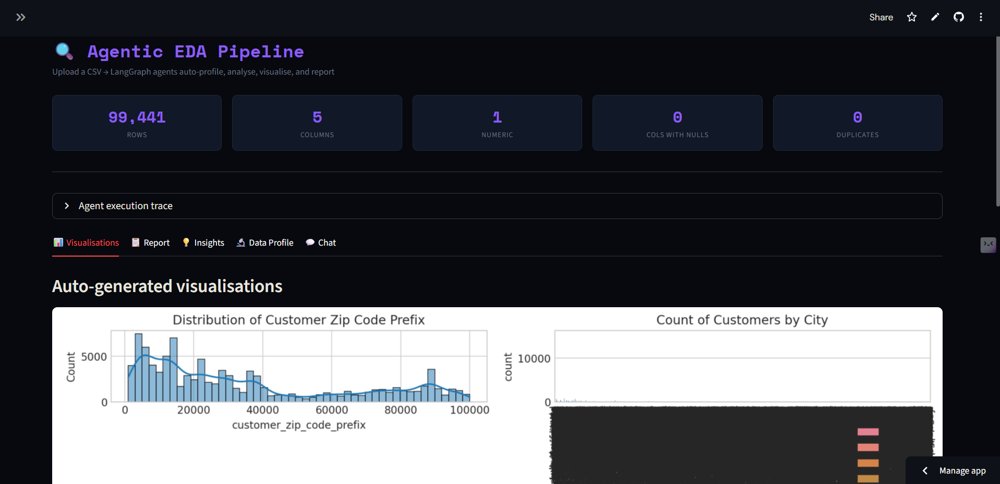

# 🔍 Agentic EDA Pipeline

An autonomous Exploratory Data Analysis system powered by LangGraph and Groq. Upload any CSV and 5 specialised agents automatically profile, analyse, visualise, and report — then chat with your data using natural language.

---

## Why this matters

Every data scientist spends hours doing EDA manually before any modeling. This project automates that entire process using a stateful multi-agent pipeline where each agent has a specific responsibility and all agents share context through a typed state graph.

---

## Architecture

```
CSV Upload
    ↓
Data Profiler Node    → shape, dtypes, nulls, duplicates, cardinality (pure pandas)
    ↓
Stats Agent Node      → descriptive stats + LLM statistical summary
    ↓
Viz Agent Node        → LLM generates optimal matplotlib/seaborn plot code
    ↓
Insight Agent Node    → LLM extracts actionable analytical insights
    ↓
Report Agent Node     → LLM compiles full structured EDA report
    ↓
Chat Interface        → context-aware Q&A using full EDA state
```

**Key LangGraph concepts used:**
- `StateGraph` with `TypedDict` shared state
- Linear pipeline with 5 nodes connected by edges
- `add_messages` annotation for conversation history
- `app.stream()` for live execution visibility
- State passed between nodes — each agent enriches it

---

## Features

- **Auto profiling** — shape, types, nulls, duplicates, cardinality
- **Statistical analysis** — descriptive stats, correlations, outlier hints
- **Auto visualisations** — agent picks the best plots for your data
- **Deep insights** — feature engineering opportunities, modeling recommendations
- **Full report** — downloadable structured EDA report
- **Chat interface** — ask follow-up questions with full EDA context

---

## Quick Start

```bash
pip install -r requirements.txt
streamlit run app.py
```

Get a free Groq API key at **https://console.groq.com**

---

## Project Structure

```
eda-agent/
├── graph.py         # LangGraph pipeline — all 5 nodes + chat function
├── app.py           # Streamlit UI — 5 tabs + chat interface
├── requirements.txt
└── README.md
```
